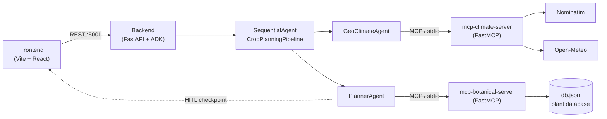

# 🌱 Urban Agri-Planner

**Urban Agri-Planner** is a multi-agent system that designs personalised urban
cultivation plans by cross-referencing **geocoding**, **historical microclimate**
and **botanical requirements**. Give it an address, the available sunlight and the
balcony/garden exposure, and it returns a climate-aware, companion-planting-aware,
12-month cultivation calendar — with a human approval step before anything is finalised.

It targets the **"AI for Good" — Agriculture** theme and is built around three pillars:

1. **Multi-Agent Systems** — orchestration with the **Google Agent Development Kit (ADK)**.
2. **Model Context Protocol (MCP)** — two Python MCP servers (FastMCP) over `stdio` transport.
3. **Agent Security & Control** — a **human-in-the-loop (HITL)** checkpoint that pauses the
   agent before finalising the crops and requires explicit user approval.

> 📖 For a deep technical walkthrough (pillar-by-pillar internals, API contract, design
> rationale), see [walkthrough.md](walkthrough.md).

---

## Architecture



The model powering both `LlmAgent` instances is **`gemma-4-26b-a4b-it`**.

---

## Components

| Component | Tech | Purpose |
| --- | --- | --- |
| [backend/](backend/) | Python · Google ADK · FastAPI | Multi-agent orchestrator. Runs the `CropPlanningPipeline` (`GeoClimateAgent` → `PlannerAgent`), connects to the MCP servers, and exposes the REST API on port `5001`. Enforces the HITL checkpoint, validates inputs, rate-limits the geocoding proxy, and keeps a bounded session store. |
| [frontend/](frontend/) | Vite · React | Single-page dashboard. Collects address/sunlight/exposure, drives the two-step plan flow, and renders an interactive **location map** + USDA zone, the calendar, planting schedule, frost dates, watering advice, an estimated **harvest & grocery-savings** panel, a **pest & disease advisor**, a **follow-up chat** with the garden advisor, and a companion-planting **list/graph** view — with `.ics` / PDF export. |
| [mcp-climate-server/](mcp-climate-server/) | Python · FastMCP | Geocoding (`get_coordinates` via Nominatim) and historical climate (`get_climate_data` via Open-Meteo) — 10-year averaged monthly profile, estimated USDA hardiness zone, and frost-date estimates. |
| [mcp-botanical-server/](mcp-botanical-server/) | Python · FastMCP | Crop knowledge: `get_compatible_plants`, `get_crop_details`, `check_companion_planting`, backed by [db.json](mcp-botanical-server/db.json). Companion logic is shared with the backend via `compute_relationships`. |

---

## How it works (two-step flow)

1. **`POST /api/plan`** runs the pipeline **up to the HITL checkpoint** and returns
   `status: "confirmation_required"` with the crops the agent proposes.
2. The user **approves, edits, or rejects** the proposed selection in the UI.
3. **`POST /api/plan/confirm`** resumes the *same* agent session with the human decision
   and returns the finalised plan (12-month calendar + planting schedule + companion
   analysis + frost dates + 7-day watering advice + estimated harvest & grocery savings)
   plus a `security` block recording the human approval.

No plan is ever finalised without explicit human approval. Seasons are flipped
automatically for Southern-Hemisphere locations based on the geocoded latitude.

---

## Quick Start

> **Prerequisites:** Python ≥ 3.10 and Node ≥ 18. A `GOOGLE_API_KEY`
> (Google AI Studio) is required for live execution with the Gemma model; the
> automated tests do **not** need one.

### 1. Backend

```bash
cd backend
python3 -m venv .venv
.venv/bin/pip install -e .          # installs ADK, FastAPI, MCP, etc.
cp .env.example .env                # then add GOOGLE_API_KEY to .env
.venv/bin/python main.py            # FastAPI on http://localhost:5001
```

### 2. Frontend

```bash
cd frontend
npm install
cp .env.example .env                # optional: set VITE_API_BASE (defaults to :5001)
npm run dev                         # http://localhost:5173
```

The MCP servers do **not** need to be started by hand: the ADK agents launch them
automatically as `stdio` subprocesses when needed.

> **Configuration:** the backend reads `ALLOWED_ORIGINS` (CORS allow-list) and
> `GOOGLE_API_KEY` from `backend/.env`; the frontend reads `VITE_API_BASE` from
> `frontend/.env`.

---

## Tests

```bash
# MCP integration tests (both servers, protocol + tools)
backend/.venv/bin/python test_mcp_servers.py

# Backend HITL tests (deterministic ScriptedModel, no API key required)
cd backend && PYTHONPATH=$PWD .venv/bin/python test_backend.py
```

---

## License

See [LICENSE](LICENSE).
